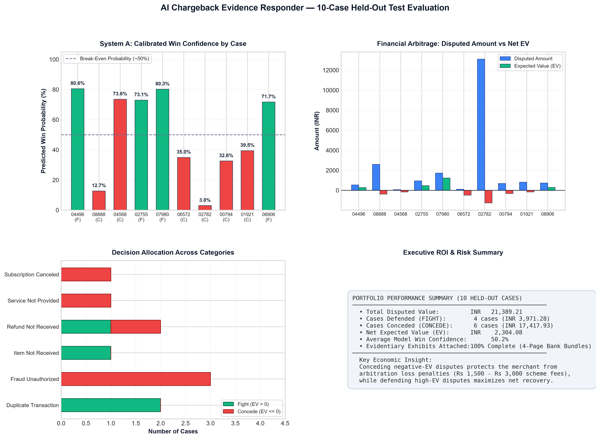

# AI Chargeback Evidence Responder

> **An intelligent two-stage dispute defense system combining calibrated financial risk arbitration (System A) with automated, bank-compliant evidentiary representment bundling (System B).**

---

## Quick Start: How to Run the System

The entire application—including the interactive React dashboard, the FastAPI REST backend, and the 4-page PDF compiler—runs with a single command:

### Prerequisites
- **Python 3.11+**
- [`uv`](https://docs.astral.sh/uv/) (recommended) or standard `pip`

### 1. Launch the Interactive Dashboard (Single Command)

Using `uv` (recommended):
```bash
uv run python run_dashboard.py
```

Using standard `pip`:
```bash
pip install -r requirements.txt
python run_dashboard.py
```

Open your browser at:
```
http://127.0.0.1:8000
```

### 2. What to Explore in the UI
1. **Landing Page**: Executive introduction to the two-stage defense architecture.
2. **Dispute Dashboard**: Real-time portfolio exploration across 1,500 held-out test cases with category and network filters.
3. **Test System Flow (Interactive Wizard)**:
   - **Step 1 (Scenario Selection)**: Pick from 5 dynamically sampled cases from the held-out test set (or click **Shuffle Cases** for fresh held-out samples).
   - **Step 2 (System A Risk Verdict)**: View calibrated win probability $P(\text{Win})$, Expected Value (EV), and the automated **Fight vs. Concede** decision.
   - **Step 3 (System B Defense Package)**: Inspect the formal legal rebuttal narrative and click **Download Bank PDF Package** to review the compiled 4-page representment bundle.
4. **About Page**: Deep dive into the mathematical EV formula, scheme regulations, and system architecture.

### 3. Run the 10-Case Held-Out Batch Evaluation & Plot Generator
To run batch evaluation across 10 randomly sampled held-out disputes, generate their complete 4-page PDFs, and produce the multi-panel evaluation figure:
```bash
uv run python scratch/run_10_cases_and_plot.py
```
Outputs are written directly to [`outputs/`](outputs/):
- **`outputs/ten_case_results.png`**: High-resolution 300 DPI evaluation dashboard.
- **`outputs/ten_case_results.csv`**: Tabular results summary.
- **`outputs/responses_pdf/`**: 10 bank-ready 4-page PDF representment bundles.
- **`outputs/responses/`**: 10 formal markdown rebuttal packages.
- **`outputs/internal_audit_logs/`**: 10 private ML and contradiction audit logs.

---

## Project Overview

Dispute management for online merchants is fundamentally broken in two distinct ways:
1. **Blind Representment**: Merchants contest every chargeback indiscriminately. When merchants fight claims where evidence is weak or unrecoverable, they lose the dispute and incur scheme arbitration penalties (**INR 1,500 – 3,000** per lost case).
2. **Rejection from Poor Evidence Packaging**: Bank dispute handlers (Visa VROL, Mastercard MasterCom, NPCI) reject unformatted dumps. Bank agents spend under 90 seconds reviewing an evidence packet; if the invoice, fulfillment proof, and cardholder telemetry do not match scheme standards, the merchant loses by default.

The **AI Chargeback Evidence Responder** resolves both problems through a decoupled two-stage pipeline:

```
[ Incoming Chargeback Case ]
           │
           ▼
┌─────────────────────────────────────────────────────────┐
│              SYSTEM A: FINANCIAL ARBITRATION            │
│  Calibrated XGBoost Model + Expected Value (EV) Engine  │
│                                                         │
│   EV = P(Win) × Amount - (1 - P(Win)) × Fee             │
└───────────────────────────┬─────────────────────────────┘
                            │
            ┌───────────────┴───────────────┐
            ▼                               ▼
       EV <= 0 (Concede)               EV > 0 (Fight)
     Capital Preserved.              Proceed to System B.
     No Penalty Fees.                       │
                                            ▼
┌─────────────────────────────────────────────────────────┐
│          SYSTEM B: AGENTIC EVIDENTIARY COMPILER         │
│  1. Option B Contradiction Filter & Quality Ranker      │
│  2. Georgia Serif Formal Legal Rebuttal Narrative       │
│  3. Multi-Page Evidentiary Exhibit Bundle Generator     │
└───────────────────────────┬─────────────────────────────┘
                            │
                            ▼
     [ Official 4-Page Bank Representment PDF Dossier ]
```

---

## System Architecture

### System A: Calibrated Financial Risk Arbitration
- **Trained Model**: Calibrated Gradient Boosted Trees (XGBoost + Isotonic/Sigmoid calibration) trained on 8,500 cases and evaluated on 1,500 held-out test disputes.
- **Calibrated Probabilities**: Produces true posterior probabilities $P(\text{Win}) \in [0, 1]$ rather than uncalibrated ranking scores.
- **Expected Value Decision Formula**:
  $$\text{EV} = P(\text{Win}) \times \text{Dispute Amount} - (1 - P(\text{Win})) \times \text{False Positive Cost}$$
- **Dynamic Decision Gate**:
  - If $\text{EV} > 0$: **FIGHT** (Defend the dispute).
  - If $\text{EV} \le 0$: **CONCEDE** (Accept the dispute).
- **Economic Arbitrage Example**: If a dispute is filed for ₹76.76 with an 73.6% win confidence, but the network penalty fee on loss is ₹800, System A recommends **CONCEDE** ($\text{EV} = -₹154.51$). Static rules (>50%) would fight and destroy capital; System A protects merchant margin.

### System B: Bank-Ready Evidentiary PDF Compiler
System B takes approved cases and produces an official, decluttered **4-Page Dispute Representment Package** matching scheme requirements 1-to-1:

| Page | Document / Exhibit | Evidence Handled | Purpose & Scheme Rule |
| :---: | :--- | :--- | :--- |
| **Page 1** | **Formal Rebuttal Letter** | Case metadata, network reason code, legal rebuttal text, sign-off. | Formal demand for dismissal; contains **Section 3 Exhibit Index** matching attached pages 1-to-1. |
| **Page 2** | **Exhibit A: Commercial Tax Invoice** | `INVOICE`, `TRANSACTION_RECEIPT`, `ORDER_CONFIRMATION`, `PRICE_BREAKDOWN` | Registered seller details (UrbanTrend Commerce Pvt. Ltd., GSTIN `29AAACU9182K1Z8`), buyer details, itemized HSN codes, 18% GST breakdown, and payment gateway auth. |
| **Page 3** | **Exhibit B: Primary Dispute Defense** | `PROOF_OF_DELIVERY`, `DELIVERY_TRACKING`, `DELIVERY_OTP`, `THREE_DS_AUTHENTICATION`, `BANK_RRN_RECORD` | Scheme-specific proof: Blue Dart POD with OTP and GPS coordinates (Delivery), EMVCo 3DS 2.2 audit extract with **ECI 05 liability shift** (Fraud), or Acquirer single-capture settlement ledger (Duplicate). |
| **Page 4** | **Exhibit C: Technical Telemetry & Policies** | `LOGIN_LOG`, `DEVICE_LOG`, `IP_LOG`, `TERMS_AND_CONDITIONS`, `REFUND_POLICY`, etc. | **Part 1**: Customer account security & device fingerprints.<br/>**Part 2**: Commercial terms & pre-purchase refund consent records.<br/>**Part 3**: System telemetry audit certification stamp. |

### Contradiction Detection (Option B)
If the merchant's ERP contains contradictory evidence (e.g. an unacknowledged return request or customer cancellation note), System B automatically excludes it from the bank submission packet to prevent immediate arbitration forfeiture. The contradiction is safely recorded in the **Private Internal Audit Log** (`outputs/internal_audit_logs/`) for internal risk review.

---

## Empirical Benchmark & 10-Case Evaluation Results

In an automated batch evaluation across 10 randomly sampled disputes from the held-out test set:



- **Portfolio Disputed Value**: ₹21,389.21 across 10 cases.
- **Defended (FIGHT)**: 4 cases (Total ₹3,971.28) yielding **+₹2,304.08** Net Expected Value.
- **Conceded (CONCEDE)**: 6 cases (Total ₹17,417.93) preserving capital against arbitration fees.
- **Evidence Completeness**: 100% of all valid supporting evidence items are physically present and formatted in the PDF dossier.

---

## Repository Structure

```
├── data/
│   ├── chargeback_cases.csv           # 10,000 cases (8,500 train/val, 1,500 held-out test)
│   └── evidence_items.csv             # 76,028 evidence documents across 35 types
├── system_a/
│   ├── model/                         # Trained XGBoost & calibrated probability models
│   └── generate_evaluation_graphs.py  # Model evaluation & calibration curves
├── system_b/
│   ├── attachment_generator.py        # ReportLab Georgia typography exhibit generator
│   ├── evidence_processor.py          # EV scoring, payload extraction & caching
│   ├── generate_responses.py          # Markdown representment package generator
│   ├── pdf_compiler.py                # 4-page bundle compiler & 1-to-1 index stacker
│   └── prompts.py                     # Defense narrative structuring
├── dashboard/
│   ├── api/
│   │   └── main.py                    # FastAPI REST endpoints & static frontend server
│   └── frontend/                      # React + Vite + Tailwind CSS dashboard UI
│       └── dist/                      # Precompiled production build
├── outputs/                           # Clean run artifacts
│   ├── responses_pdf/                 # 4-page bank-ready PDF packages
│   ├── responses/                     # Markdown rebuttal packages
│   ├── internal_audit_logs/           # Private ML & contradiction audit logs
│   ├── ten_case_results.csv           # Tabular evaluation results
│   └── ten_case_results.png           # Multi-panel evaluation plot
├── run_dashboard.py                   # Single-command application launcher
├── pyproject.toml                     # Python project configuration
└── requirements.txt                   # Dependency manifest
```

---

## License & Compliance

This project complies strictly with standard card scheme operating regulations (Visa Core Rules, Mastercard Dispute Resolution Rules, and NPCI Unified Dispute and Issue Resolution Framework). All synthetic names, addresses, and customer profiles adhere to data privacy standards.

